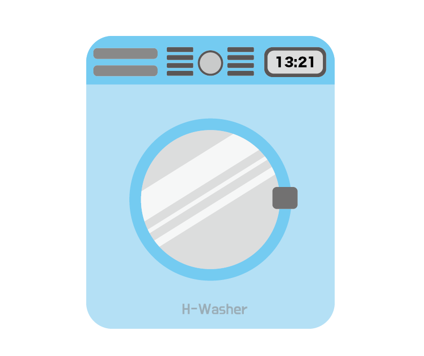

<h1>2023 OSS MiniProject</h1>
<h2>🧺 H-Washer</h2>

  

<h2>🧺 H-Washer 주제</h2>

세탁기 사용 예약 시스템

 

<h2>🧺 H-Washer 소개</h2>

한동대학교 각 기숙사 별 위치한 <b style = "color : #1793D1">세탁기</b>에 대하여 <u>가상 이용 예약 시스템</u>을 구현한 프로젝트입니다. 
사용자는 기숙사, 층, 세탁기 종류에 따라서 <u>사용 예약</u>을 진행할 수 있으며, <u>예약 현황도 확인</u>할 수 있습니다. 
추가적으로 세탁카드(코인), 세제 및 섬유유연제 개수 등에 대한 정보를 갖고 있으며, 구매하는 기능까지 구현했습니다.

 

<h2>🧺 H-Washer의 간략한 기능 설명</h2>
<ol>
    <li>세탁 내용 조회
    : 원하는 기숙사와 층별 세탁기의 예약 현황을 조회할 수 있다.</li>
    <li>세탁 내용 등록
    : 원하는 기숙사와 층별 세탁기에 예약을 진행할 수 있다.</li>
    <li>세탁 내용 수정
    : 자신이 예약한 예약 내용을 수정할 수 있다.</li>
    <li>세탁 내용 삭제
    : 자신이 예약한 예약 내용을 삭제할 수 있다.</li>
    <li>세탁 내용 검색
    : 전체 예약 중 이름으로 예약 내용을 조회할 수 있다.</li>
    <li>파일 저장
    : 예약되어 있는 전체 예약 내용을 저장한다.</li>
    <li>유저 정보 수정하기
    : 자신의 정보를 수정할 수 있다.</li>
    <li>세탁 SHOP
    : 빨래 카드 충전, 세제 및 섬유유연제를 구매할 수 있다.</li>
</ol>
 

<h2>🧺 개발환경 및 언어</h2>

 

<h2>🧺 Team Member</h2>
<table style = "border : 1 solid while; text-align : center; background-color : gray; width : 80vw">
<tr>
    <td></td>
    <td></td>
</tr>
<tr>
    <td style = "width : 50vw; "><b>👥 김광일 👥</b></td>
    <td style = "width : 50vw; "><b>👥 김동규 👥</b></td>
</tr>
<tr>
    <td style = "width : 50vw; height : 100%">Owner EADME.md 제작 CRUD / 파일IO 구현 코드 관리(수정) github 관리</td>
    <td style = "width : 50vw; height : 100%">Owner github WIKI page 제작 부가 기능 구현 코드 관리(수정)  프로젝트 관리</td>
</tr>
</table>
 
